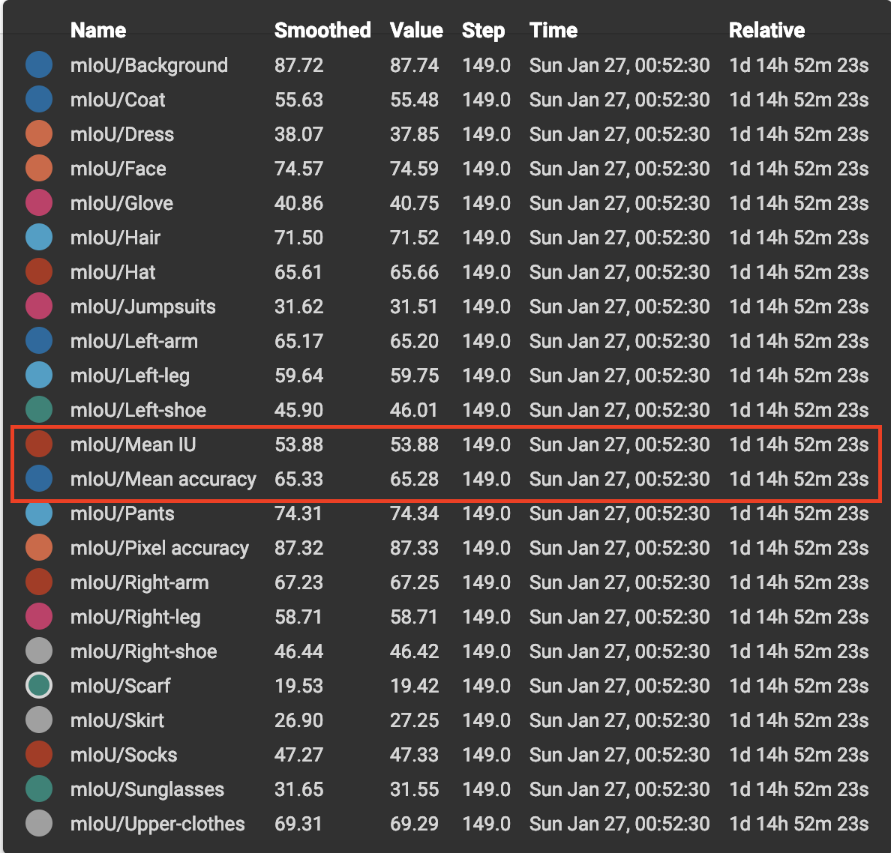

# CE2P

This respository includes a PyTorch implementation of [CE2P](https://arxiv.org/abs/1809.05996) that won the 1st places of single human parsing in the 2nd LIP Challenge.  The M-CE2P used for multiple human parsing is provided in [https://github.com/RanTaimu/M-CE2P](https://github.com/RanTaimu/M-CE2P).  

The code is based upon [https://github.com/speedinghzl/pytorch-segmentation-toolbox](https://github.com/speedinghzl/pytorch-segmentation-toolbox), and the data processing is based upon [https://github.com/Microsoft/human-pose-estimation.pytorch](https://github.com/Microsoft/human-pose-estimation.pytorch)

### Requirements

python 3.6   

PyTorch 0.4.1  

To install PyTorch, please refer to https://github.com/pytorch/pytorch#installation.  


Or using anaconda:  conda env create -f environment.yaml  


Or to use Pytorch 1.0, just replace 'libs' with 'modules' in [https://github.com/mapillary/inplace_abn](https://github.com/mapillary/inplace_abn), and rename it to 'libs'. 

### Compiling

Some parts of InPlace-ABN have a native CUDA implementation, which must be compiled with the following commands:
```bash
cd libs
sh build.sh
python build.py
``` 
The `build.sh` script assumes that the `nvcc` compiler is available in the current system search path.
The CUDA kernels are compiled for `sm_50`, `sm_52` and `sm_61` by default.
To change this (_e.g._ if you are using a Kepler GPU), please edit the `CUDA_GENCODE` variable in `build.sh`.

### Dataset and pretrained model
**Note** that the left and right label should be swapped when the label file is flipped. 

Plesae download [LIP](http://sysu-hcp.net/lip/overview.php) dataset and create symbolic links:
ln -s YOUR_LIP_DATASET_DIR dataset/LIP 
  
The contents of LIP Dataset include: 

├── train_images   

├── train_segmentations  

├── val_images  

├── val_segmentations  

├── test_images   

├── train_id.txt  

├── val_id.txt  

├── test_id.txt  

 
Please download imagenet pretrained resent-101 from [baidu drive](https://pan.baidu.com/s/1NoxI_JetjSVa7uqgVSKdPw) or [Google drive](https://drive.google.com/open?id=1rzLU-wK6rEorCNJfwrmIu5hY2wRMyKTK), and put it into dataset folder.

### Training and Evaluation
```bash
./run.sh
```
To evaluate the results, please download 'LIP_epoch_149.pth' from [baidu drive](https://pan.baidu.com/s/1NoxI_JetjSVa7uqgVSKdPw) or [Google drive](https://drive.google.com/open?id=1rzLU-wK6rEorCNJfwrmIu5hY2wRMyKTK), and put into snapshots directory. 
```
./run_evaluate.sh
``` 
The parsing result of the provided 'LIP_epoch_149.pth' is 53.88 without any bells and whistles,


If this code is helpful for your research, please cite the following paper:

    @article{CE2P2019,
      title={Devil in the Details: Towards Accurate Single and Multiple Human Parsing},
      author={Tao Ruan, Ting Liu, Zilong Huang, Yunchao Wei, Shikui Wei, Yao Zhao, Thomas Huang},
      journal={arXiv:1809.05996},
      year={2018}
    }
